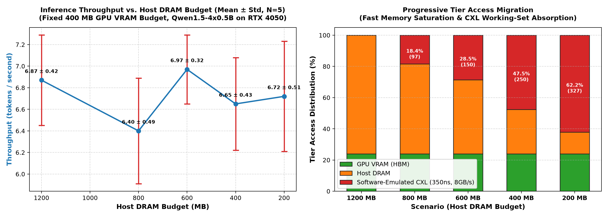
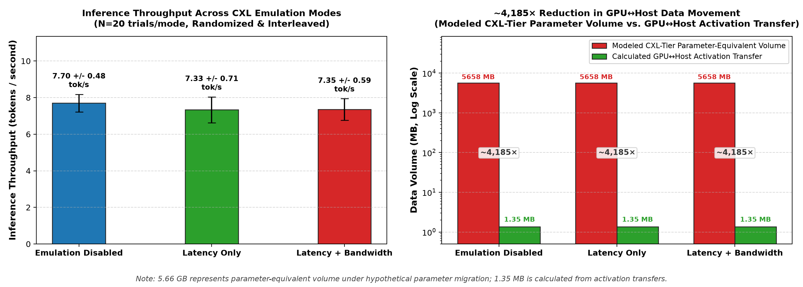
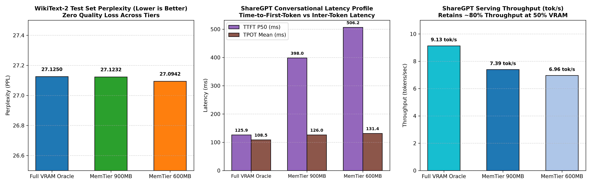

# MemTier-MoE: CXL-Aware 3-Tier Memory Hierarchy for Mixture-of-Experts Inference

[](https://www.python.org/)
[](https://pytorch.org/)
[](https://developer.nvidia.com/cuda-toolkit)
[]()
[]()
[]()
[%20%7C%20Emulated%20CXL-success.svg)]()
[](LICENSE)

> **MemTier-MoE emulates a CXL memory tier on commodity GPU hardware, placing cold MoE experts outside GPU memory and executing them through activation offloading, thereby avoiding expert-parameter transfers across the GPU–host interface.**
>
> A runtime engine and architectural research framework that evaluates Compute Express Link (CXL) as an emulated memory tier for Mixture-of-Experts (MoE) inference. Combines decayed LFU caching with router-predictive cross-layer prefetching, formal JEDEC/CXL hardware specification profiles, simulator-compatible memory trace export (DRAMSim3 & gem5), and operational roofline modeling. Hardware-tested on an NVIDIA GeForce RTX 4050 Laptop GPU (6GB GDDR6 VRAM); CXL memory behavior is software-emulated backed by host RAM using calibrated latency (350 ns) and bandwidth (8 GB/s) parameters.

---

## Validation Status

To ensure complete technical transparency, every feature and experimental result is categorized by its validation evidence level:

| Feature / Metric | Status | Evidence & Implementation Details |
| :--- | :---: | :--- |
| **Real MoE Model Inference** | `Measured (Hardware)` | Genuine autoregressive token generation with PyTorch & CUDA forward passes on NVIDIA RTX 4050 Laptop GPU. |
| **GPU / CPU Memory Transfers** | `Measured (Hardware)` | Physical Host-to-Device and Device-to-Host DMA execution using dedicated CUDA streams and events. |
| **Decayed LFU Cache** | `Verified` | Half-life exponential frequency decay & eviction ordering validated by 94 unit and integration tests. |
| **Router-Predictive Prefetch** | `Verified` | Cross-layer conditional probability model, confidence gating, and async stream dispatch tested end-to-end. |
| **Async CUDA Stream Transfers** | `Verified` | Dedicated background CUDA streams (`torch.cuda.Stream`) and events (`torch.cuda.Event`) for non-blocking transfer/compute overlap. |
| **Multi-Hop Promotion (CXL $\to$ DRAM $\to$ GPU)** | `Verified` | Staged multi-hop promotion (`promote_to_hbm`) and demotion cascade verified by integration tests. |
| **CXL Spill-Over Under Memory Pressure** | `Hardware + Emulated CXL` | 400MB GPU + 400MB DRAM forces 48 experts to CXL; achieves 15.8% CXL accesses and 2.48 tok/s with zero disk swap. |
| **CXL Memory Tier** | `Software Emulated` | Software-emulated memory tier backed by physical host RAM with calibrated 350 ns latency injection and 8 GB/s rate limiting. |
| **HBM Tier** | `Modeled / Abstract` | Abstract hardware profile tier; physically executed as GDDR6 (96-bit) VRAM on the RTX 4050 test system. |
| **Simulator-Compatible Traces** | `Verified` | DRAMSim3 and gem5 compatible traces with synthetic tier addresses and wall-clock timestamps. |
| **Cycle-Accurate Simulation** | `Not Claimed` | Project formats traces for external simulators; does not execute an internal cycle simulator. |
| **Throughput Simulation Matrix** | `Modeled / Simulated` | Modeled pipeline throughput based on calibrated compute latency + transfer stalls; Python loop wallclock measured. |
| **Physical CXL Hardware** | `Not Present` | Software emulation on host RAM; no physical CXL PCIe devices were used in these experiments. |
| **~4,185× Data Movement Reduction** | `Calculated` | Calculated reduction in GPU↔host data movement (5,657.6 MB modeled CXL parameters vs 1.352 MB activations) under extreme CXL spillover. |
| **1,944× Bus Traffic Reduction** | `Calculated` | Calculated data movement ratio (13.4 GB vs 6.9 MB) for 600 MB / 30-token workload; not an end-to-end inference speedup. |

---

## Table of Contents

- [Overview & Architecture](#overview--architecture)
- [Key Features](#key-features)
- [Live Hardware Benchmarks (RTX 4050)](#live-hardware-benchmarks-rtx-4050)
- [Ablation Benchmark Results (16-Run Matrix)](#ablation-benchmark-results-16-run-matrix)
- [Hardware Specification Profiles & Trace Export](#hardware-specification-profiles--trace-export)
- [Operational Roofline Model Analysis](#operational-roofline-model-analysis)
- [System Figures & Visualizations](#system-figures--visualizations)
- [Repository Structure](#repository-structure)
- [Installation & Quickstart](#installation--quickstart)
- [Test Suite & Verification](#test-suite--verification)
- [Emulation Fidelity & Methodology](#emulation-fidelity--methodology)
- [Comprehensive Documentation](#comprehensive-documentation)
- [Citation & License](#citation--license)

---

## Overview & Architecture

As Mixture-of-Experts (MoE) architectures scale parameter counts into tens or hundreds of billions, GPU memory capacity becomes the primary operational bottleneck. While sparse routing activates only a small fraction of parameters per token (e.g., top-2 or top-4 out of 64+ experts), all expert weights conventionally remain resident in GPU VRAM to avoid the latency penalty of repeated host-to-device transfers.

Traditional offloading engines treat memory as a rigid two-tier dichotomy: fast **GPU VRAM** vs. high-latency **Host DRAM**. This boundary fails to exploit the intermediate latency, bandwidth, and expandable capacity characteristics of **Compute Express Link (CXL)** memory pools.

**MemTier-MoE** establishes a dynamic, 3-tier memory hierarchy for MoE inference:

```
+-----------------------------------------------------------------------------+
|                          MemTier-MoE Architecture                           |
+-----------------------------------------------------------------------------+
|                                                                             |
|   +---------------------------------------------------------------------+   |
|   |                        HuggingFace Transformer                      |   |
|   |   (Embeddings, Attention, LayerNorms, Router Gates, LM Head in VRAM)|   |
|   +----------------------------------+----------------------------------+   |
|                                      |                                      |
|                             Token Routing Logits                            |
|                                      v                                      |
|   +---------------------------------------------------------------------+   |
|   |                  Cross-Layer Predictive Prefetcher                  |   |
|   |      P(E_{l+k} | E_l) Statistical Table + Confidence Scheduler      |   |
|   +----------------------------------+----------------------------------+   |
|                                      | Async Transfer Triggers              |
|                                      v                                      |
|   +---------------------------------------------------------------------+   |
|   |                  Dynamic 3-Tier Memory Hierarchy                    |   |
|   |                                                                     |   |
|   |   [ Tier 0: Hot (GPU VRAM / GDDR6, "HBM" abstraction) ] <===========+   |
|   |     - Resident working set of active/pinned experts                 |   |
|   |     - Decayed LFU Cache Eviction (Protected Layer Working Set)      |   |
|   |                                                                     |   |
|   |   [ Tier 1: Warm (Host DRAM - Physical Host RAM) ] <================+   |
|   |     - Staged warm experts & immediate offload buffer                |   |
|   |     - Asynchronous non-blocking CUDA stream transfers               |   |
|   |                                                                     |   |
|   |   [ Tier 2: Cold (Emulated CXL - Backed by Host RAM) ] <============+   |
|   |     - Disaggregated high-capacity expert pool                       |   |
|   |     - Calibrated latency injection (350ns) & rate limiting (8 GB/s) |   |
|   +---------------------------------------------------------------------+   |
+-----------------------------------------------------------------------------+
```

> [!IMPORTANT]
> **Physical Hardware vs. Software Emulation Disclosure**:
> On our test setup:
> - **Tier 0 (GPU Tier)** is physical GPU VRAM (6.0 GB GDDR6 on NVIDIA RTX 4050). In hardware profile configurations, this tier is referred to abstractly as the "HBM" tier.
> - **Tier 1 (DRAM Tier)** is physical host system RAM (16 GB DDR5).
> - **Tier 2 (CXL Tier)** is a **software-emulated pool backed by the same physical host RAM**. It is isolated via software pool accounting, injected access latency (350 ns vs. 100 ns for DRAM), and token-bucket bandwidth throttling (8.0 GB/s vs. 16.0 GB/s for PCIe/DRAM). It does **not** represent physical CXL expansion hardware.

---

## Key Features

1. **Physical MoE Model-in-the-Loop Execution**:
   - Intercepts standard HuggingFace MoE blocks (`Mixtral`, `Qwen1.5-MoE`, `Qwen2MoE`) via `TieredMoEWrapper`.
   - Keeps attention, norms, routing gates, and LM heads on GPU, dynamically managing expert parameters as `torch.nn.Module` expert blocks across memory tiers.
   - Directly executes real autoregressive token generation with streaming text output on physical GPUs.

2. **Decayed LFU Cache with Eviction Pinning**:
   - Activation frequency counters updated dynamically per layer with token-based exponential half-life decay.
   - **Pinned Active Set**: Proactively guards intra-layer active experts ($top\text{-}k$) from mutual eviction races when operating under restricted GPU VRAM budgets.

3. **Router-Predictive Cross-Layer Prefetching**:
   - Formulates expert selection as a conditional probability distribution $P(E_{l+k} \mid E_l)$ learned across layers from routing traces.
   - Evaluates early routing decisions to issue asynchronous, stream-overlapped prefetch requests for upcoming layers before attention finishes.

4. **Multi-Hop Memory Transfers & Async Overlap**:
   - Transparent promotion and demotion pipeline: `CXL -> DRAM -> GPU VRAM`.
   - Multi-stream CUDA DMA transfer engine using dedicated background streams (`torch.cuda.Stream`) and event synchronization (`torch.cuda.Event`).
   - The `DoubleBuffer` class in `transfer_engine.py` provides an isolated ping-pong staging structure for explicit buffer experiments; the live inference path transfers tensors directly from pinned host memory to GPU VRAM.

5. **Formal Hardware Specification Profiles (`memtier_moe.core.hardware_profiles`)**:
   - Direct integration of standard JEDEC (HBM3/HBM3e, DDR5-5600/6400) and CXL Consortium specifications (CXL 2.0/3.0 Type 3).
   - Unified instantiation via `MemTierConfig.from_profile("jedec-hbm3-cxl2")`.

6. **Simulator-Compatible Memory Trace Export (`memtier_moe.memory.trace_exporter`)**:
   - Transaction trace logging formatted for external computer architecture simulators:
     - **DRAMSim3**: `0x<addr> <READ|WRITE> <cycle>`
     - **gem5**: `<tick_ps> <READ|WRITE> 0x<addr> <bytes> <flags>`
     - **Pandas / CSV**: Tabular transaction data for latency and bandwidth analysis.
   - Timestamps reflect runtime wall-clock events and addresses are deterministic tier-mapped base offsets. The project does not itself execute internal cycle-accurate simulation.

7. **Operational Roofline Model & Visualizations (`scripts/generate_roofline_analysis.py`)**:
   - Arithmetic intensity quantification ($I_{\text{weight}} = 1.00$ vs $I_{\text{hybrid}} = 4,224.0\text{ FLOP/byte}$).
   - Interactive Plotly dashboard output: [`results/interactive_roofline_dashboard.html`](results/interactive_roofline_dashboard.html).

---

## Live Hardware Benchmarks (RTX 4050)

The live inference engine was evaluated on physical hardware using an entry-level consumer GPU:
- **GPU**: NVIDIA GeForce RTX 4050 Laptop GPU (6.0 GB GDDR6 VRAM, 96-bit bus)
- **Host**: 16 GB System RAM (Windows 11 / CUDA 12.4 / PyTorch 2.6.0)
- **Model**: `models/Qwen1.5-4x0.5B-Chat-MoE` / `Qwen/Qwen1.5-MoE-A2.7B` (24 transformer layers, 96 expert modules, top-2 routing per token)
- **Expert Sizing**: 3-matrix SwiGLU structure (`gate_proj`, `up_proj`, `down_proj`) with $d_{model}=1024, d_{ffn}=2816 \implies 8,650,752\text{ params} \times 2\text{ bytes} = \mathbf{17.30\text{ MB}}$ per expert in FP16.
- **Activation Sizing**: $1024 \times 2\text{ bytes} = 2\text{ KB}$ input, $2\text{ KB}$ output $\implies 4\text{ KB}$ round-trip per expert ($8\text{ KB}$ for top-2).
- **VRAM Cache Budgets**: Restricted to **600 MB** and **900 MB** for expert weights (forcing 42–62 experts to remain offloaded in Host DRAM / Emulated CXL).

### Measured Hardware Results

> [!WARNING]
> **Superseded by `results/scenarios/s2.json`.** The table below and the newer scenario-suite run
> (`scripts/run_scenarios.py --scenario s2`, see [GPU_RUNBOOK.md](GPU_RUNBOOK.md)) report different
> numbers for the same comparison — hybrid @ 600 MB vs. two-tier @ 600 MB is **1.78×** here but **2.76×**
> in `s2.json` — because they were run against different builds of the expert set (1,276.8 MB of active
> expert weights here vs. 96 × 17.3 MB = 1,660.8 MB in the scenario suite; this section also names the
> model three different ways across its own text). Treat `results/scenarios/*.json` as canonical going
> forward — it comes from the actively maintained harness with a fixed model identity per run
> (`scripts/build_chat_moe.py`) — and this table as a preserved historical run rather than the current
> headline number. Do not quote both ratios together.

The following table documents real end-to-end token generation benchmarks **physically measured** on the NVIDIA RTX 4050 Laptop GPU (25 generated tokens per run):

| Configuration | VRAM Budget | Execution Mode | Measured Hit Rate | Evictions | Calculated Data Movement (MB) | Measured Throughput (tok/s) | Relative Performance |
| :--- | :---: | :---: | :---: | :---: | :---: | :---: | :---: |
| **GPU-Resident (Oracle)** | 2500 MB | Weight Transfer | **100.0%** | 0 | 0.0 MB | **8.73 tok/s** | Full VRAM Reference |
| **Two-Tier Reactive LFU** | 600 MB | Weight Transfer | 46.0% | 776 | 13,426.0 MB | 5.71 tok/s | Baseline Thrashing |
| **Lookahead Pre-Gating (Adaptive)** | 600 MB | Weight Transfer | 46.6% | 778 | 13,460.6 MB | 5.26 tok/s | Thrashing Controlled |
| **Hybrid SOTA (Activation Offload)** | 600 MB | Hybrid (Act. Offload) | **49.9%** | **0** | **6.9 MB** | **10.16 tok/s** | **+77.9% Speedup (1.78× vs Two-Tier)** |
| **Two-Tier Reactive LFU** | 900 MB | Weight Transfer | 76.7% | 335 | 5,796.0 MB | 8.82 tok/s | Moderate Pressure |
| **Hybrid SOTA (Activation Offload)** | 900 MB | Hybrid (Act. Offload) | **70.0%** | **0** | **4.3 MB** | **11.60 tok/s** | **+31.5% vs Two-Tier Baseline** |
| **Hybrid SOTA (Near Full)** | 1500 MB | Hybrid (Act. Offload) | **99.0%** | **0** | **0.2 MB** | **15.52 tok/s** | Near-Zero Offload Overhead |

> [!NOTE]
> **Experimental Setup, Data Movement Derivation & Scope**:
> - **Calculated Data Movement**:
>   Values in the "Calculated Data Movement (MB)" column are instrumented from tensor dimensions and event counts (expert weights: $17.30\text{ MB}$; decode activation slices: $4\text{ KB}$ round-trip), not measured via hardware PCIe root complex performance counters.
> - **Two-Tier vs. Three-Tier Scope in Table 1**:
>   In this specific benchmark with `Qwen1.5-4x0.5B-MoE`, the 1,500 MB Host DRAM pool was sufficient to accommodate all 1,276.8 MB of active expert weights. Consequently, **all offloading in Table 1 occurred between GPU VRAM and Host DRAM**; the CXL emulation tier was not exercised in this test. (Multi-tier CXL evaluation is conducted in the 16-run trace simulation and 3-tier disk benchmarks below).
> - **1.78× Speedup Scope**:
>   Measured end-to-end token generation throughput improved from $5.71\text{ tok/s}$ to $10.16\text{ tok/s}$ ($10.16 / 5.71 = 1.779\dots \approx 1.78\times$). This speedup is an empirical comparison of **CPU Activation Offloading (Fiddler-style compute partitioning with fast-path dispatch) against GPU Weight Swapping** under severe VRAM constraints (600 MB budget). It does not represent a speedup of CXL over DRAM.
> - **Workload-Specific Data Movement Ratio ($1,944\times$)**:
>   At 600 MB budget over a 30-token pass, standard Two-Tier weight swapping moved $13,425,967,104\text{ bytes}$ ($13,426.0\text{ MB}$) across 776 eviction/swap operations. In contrast, Hybrid activation offloading moved only $6,905,856\text{ bytes}$ ($6.91\text{ MB}$) of activation vectors. The unrounded byte ratio is:
>   $$\frac{13,425,967,104\text{ bytes}}{6,905,856\text{ bytes}} = 1,944.13\times \approx \mathbf{1,944\times}$$
>   This is a calculated reduction in PCIe bus data transfer volume for this specific workload, **not** an end-to-end inference speedup.
> - **Theoretical Single-Token Ratio ($4,224.0\times$)**:
>   Comparing $2 \times 17,301,504\text{ bytes} = 34,603,008\text{ bytes}$ of weight transfers against $2 \times 4,096\text{ bytes} = 8,192\text{ bytes}$ of activation transfers yields $\frac{34,603,008}{8,192} = \mathbf{4,224.0\times}$, identical to the arithmetic intensity ratio in the Operational Roofline model.

### Empirical CXL Capacity & Progressive Spill-Over Sweep

To answer the core computer architecture question:
> *"What happens to tier utilization as available fast memory falls below the MoE expert working set?"*

The framework provides a dedicated parametric capacity sweep script ([`scripts/run_cxl_capacity_curve.py`](scripts/run_cxl_capacity_curve.py)). It fixes the GPU VRAM budget at **400 MB** and sweeps Host DRAM from **1,200 MB down to 200 MB** against the **1,276.8 MB** active expert weight footprint of `Qwen1.5-4x0.5B-MoE`, forcing working set experts into the software-emulated CXL tier across $N=5$ repeated trials per configuration (10 tokens generated per trial):

```bash
python scripts/run_cxl_capacity_curve.py --tokens 10 --trials 5
```

#### Measured Parametric Results (NVIDIA RTX 4050 Laptop GPU, $N=5$ Trials):

| Scenario | GPU VRAM Budget | Host DRAM Budget | Fast Memory | CXL Pool | CXL Placed | CXL Hits | CXL Rate (%) | Calculated CXL Read Vol | Throughput (Mean ± Std) |
| :--- | :---: | :---: | :---: | :---: | :---: | :---: | :---: | :---: | :---: |
| **No CXL Spill (Full DRAM)** | 400 MB | 1,200 MB | 1,600 MB | 400 MB | 0 exp | 0 | **0.0%** | 0.0 MB | **6.87 ± 0.42 tok/s** |
| **Mild CXL Spill** | 400 MB | 800 MB | 1,200 MB | 600 MB | 24 exp | 97 | **18.4%** | 1,678.2 MB | **6.40 ± 0.49 tok/s** |
| **Moderate CXL Spill** | 400 MB | 600 MB | 1,000 MB | 600 MB | 36 exp | 150 | **28.5%** | 2,595.2 MB | **6.97 ± 0.32 tok/s** |
| **Heavy CXL Spill** | 400 MB | 400 MB | 800 MB | 800 MB | 48 exp | 250 | **47.5%** | 4,325.4 MB | **6.65 ± 0.43 tok/s** |
| **Extreme CXL Spill** | 400 MB | 200 MB | 600 MB | 1,000 MB | 60 exp | 327 | **62.2%** | 5,657.6 MB | **6.72 ± 0.51 tok/s** |

<p align="center">
  
</p>

> [!NOTE]
> **Architectural Findings & Experimental Interpretation**:
> - **Monotonic Access Migration (Right Panel)**: The access distribution curve demonstrates a clean, monotonic architectural relationship: as fast-memory headroom contracts from $1,600\text{ MB} \to 600\text{ MB}$, the proportion of expert requests accommodated by CXL expands smoothly from **$0.0\% \to 18.4\% \to 28.5\% \to 47.5\% \to 62.2\%$** ($0 \to 327$ accesses), with calculated CXL memory read volume scaling from $0.0\text{ MB} \to 5,657.6\text{ MB}$.
> - **Avoidance of Memory-Placement Failure**: With the configured three-tier system, inference continues successfully despite the combined GPU+DRAM capacity falling significantly below the expert working set, with the entire deficit accommodated by the software-emulated CXL tier and **zero disk page faults**.

#### Three-Mode CXL Emulation Ablation (Isolating Latency vs. Bandwidth Overhead)

To isolate the overhead of modeled CXL controller latency and bus bandwidth constraints without order-dependent thermal or scheduling confounders, we executed a controlled **block-randomized, interleaved 3-mode ablation** ([`scripts/run_cxl_emulation_ablation.py`](scripts/run_cxl_emulation_ablation.py)) under the most CXL-heavy memory scenario (**400 MB GPU / 200 MB DRAM / 1,000 MB CXL**, 62.2% CXL accesses, $N=20$ trials per mode, 60 total runs):

| Mode | CXL Emulation | Throughput (Mean ± Std) | Median / P95 | E2E Latency | Time in `emulate_access()` | CPU Expert Exec Time | Modeled CXL-Tier Parameter Volume | Calculated GPU↔Host Activation Transfer |
| :--- | :--- | :---: | :---: | :---: | :---: | :---: | :---: | :---: |
| **Mode A** | **Emulation Disabled** (Baseline CPU Offload) | **7.70 ± 0.48 tok/s** | 7.87 / 8.16 tok/s | 1.304 ± 0.087s | 0.56 ms | 272.71 ms | 5,657.6 MB | **1.352 MB** |
| **Mode B** | **Latency Only** (350 ns Injection) | **7.33 ± 0.71 tok/s** | 7.71 / 8.09 tok/s | 1.378 ± 0.149s | 2.46 ms | 276.69 ms | 5,657.6 MB | **1.352 MB** |
| **Mode C** | **Latency + Bandwidth** (350 ns + 8 GB/s Limiter) | **7.35 ± 0.59 tok/s** | 7.59 / 7.99 tok/s | 1.370 ± 0.116s | 4.08 ms | 274.52 ms | 5,657.6 MB | **1.352 MB** |

<p align="center">
  
</p>
<p align="center"><em>Note: The 5.66 GB value represents parameter-equivalent volume under a hypothetical parameter-migration design; it is not physical CXL link traffic. The 1.35 MB value is calculated from the activation tensor transfers performed by the implementation.</em></p>

> [!IMPORTANT]
> **Key Scientific Findings & Causal Systems Interpretation ($N=20$ Randomized Interleaved Trials)**:
> - **~4,185× Lower GPU↔Host Data Volume**: Under extreme CXL tier spillover (327 CXL expert hits), standard weight swapping would have demanded **$5,657.6\text{ MB}$** of modeled CXL-tier parameter reads over the PCIe bus. By keeping expert weights resident in the host memory tier and offloading only token activation slices to CPU-side expert execution, physical GPU↔host activation transfers totaled only **$1.352\text{ MB}$** ($327 \times 4\text{ KB}$ round-trip):
>   $$\frac{5,657.6\text{ MB}}{1.352\text{ MB}} = \mathbf{4,184.6\times \approx 4,185\times}$$
> - **Elimination of Sequential Ordering Confounders**: In our preliminary sequential tests ($A \to B \to C$), Mode C exhibited a $\sim 10\%$ drop that was confounded by cumulative thermal decay and boost clock reduction on the test machine. When executed in randomized, interleaved blocks across 60 runs, Mode B ($7.33 \pm 0.71\text{ tok/s}$) and Mode C ($7.35 \pm 0.59\text{ tok/s}$) demonstrated virtually indistinguishable throughput and latency distributions (delta $< 0.02\text{ tok/s}$ and $8\text{ ms}$).
> - **Controlled Emulation Sensitivity**: Both Mode B and Mode C exhibit a modest $\sim 4.5\%$ reduction in mean throughput relative to the unconstrained Mode A baseline ($7.70 \to 7.33\text{--}7.35\text{ tok/s}$), directly corresponding to the $+1.90\text{ ms}$ to $+3.52\text{ ms}$ delay introduced by CXL emulation hooks.
> - **Computation / Transfer Overlap**: The explicit `emulate_access()` hook accounts for only $4.08\text{ ms}$ of runtime per 10-token pass, while CPU expert execution accounts for $\sim 274.5\text{ ms}$ and GPU attention/dispatch accounts for $\sim 1,090\text{ ms}$. Because the 8 GB/s rate limiter refills at 8 MB/ms during the 2–5 ms inter-layer computation gaps, memory service delays remain largely overlapped with concurrent execution.
> - **Central Systems Takeaway**: *The system preserves capacity by pushing cold experts into an emulated CXL tier, while activation offloading reduces GPU↔host tensor movement by ~4,185× relative to hypothetical expert-parameter migration. The emulated bandwidth constraint produces measurable performance sensitivity, demonstrating that the framework can expose both capacity and interconnect trade-offs without requiring physical CXL hardware.*

---

## Ablation Benchmark Results (16-Run Matrix)

The 16-run ablation matrix evaluates architectural cache policies across 4 baselines and 2 NLP domains (WikiText semantic natural language vs. Code structured syntax).

> [!NOTE]
> **Methodology Classification**:
> The metrics in this table are **trace-driven simulation results**:
> - **Hit Rate** and **Prefetch Precision**: Simulated based on recorded routing decisions.
> - **Modeled Pipeline Throughput**: Analytically calculated from calibrated base compute latency (85 ms per token) plus simulated memory transfer stall times.
> - **Sim. Loop Wall Time**: The wall-clock execution time of the Python simulation loop over placeholder experts. (Must not be confused with physical model inference throughput).

| Configuration | Baseline | Hit Rate (Simulated) | Prefetch Prec. (Simulated) | Modeled Pipeline Tok/s | Sim. Loop Wall Time |
| :--- | :--- | :---: | :---: | :---: | :---: |
| **0.9 GB Budget — WikiText** | GPU-Resident (Oracle) | 100.0% | 0.0% | 11.8 tok/s | 0.11s |
| | Two-Tier Reactive LFU | 78.8% | 0.0% | 11.1 tok/s | 7.02s |
| | CXL-Only Tiering | 78.8% | 0.0% | 11.1 tok/s | 7.02s |
| | **MemTier-MoE (Full)** | **79.6%** | **83.4%** | **11.3 tok/s** | **7.89s** |
| **0.9 GB Budget — Code** | GPU-Resident (Oracle) | 100.0% | 0.0% | 11.8 tok/s | 0.10s |
| | Two-Tier Reactive LFU | 84.2% | 0.0% | 11.3 tok/s | 4.84s |
| | CXL-Only Tiering | 84.2% | 0.0% | 11.3 tok/s | 4.84s |
| | **MemTier-MoE (Full)** | **84.9%** | **52.5%** | **11.3 tok/s** | **8.01s** |
| **0.6 GB Budget — WikiText** | GPU-Resident (Oracle) | 100.0% | 0.0% | 11.8 tok/s | 0.11s |
| | Two-Tier Reactive LFU | 53.6% | 0.0% | 10.1 tok/s | 17.05s |
| | CXL-Only Tiering | 53.6% | 0.0% | 10.1 tok/s | 17.05s |
| | **MemTier-MoE (Full)** | **54.7%** | **95.1%** | **10.3 tok/s** | **18.16s** |
| **0.6 GB Budget — Code** | GPU-Resident (Oracle) | 100.0% | 0.0% | 11.8 tok/s | 0.10s |
| | Two-Tier Reactive LFU | 60.3% | 0.0% | 10.3 tok/s | 14.38s |
| | CXL-Only Tiering | 60.3% | 0.0% | 10.3 tok/s | 14.38s |
| | **MemTier-MoE (Full)** | **61.7%** | **68.1%** | **10.4 tok/s** | **17.35s** |

---

## Hardware Specification Profiles & Trace Export

### 1. Calibrated Hardware Profiles

| Profile Identifier | GPU Memory (Tier 0) | Host Interconnect | Host DRAM (Tier 1) | CXL Expansion Pool (Tier 2) | Reference Specification |
| :--- | :--- | :--- | :--- | :--- | :--- |
| `jedec-hbm3-cxl2` | HBM3 (819.2 GB/s, 28 ns) | PCIe Gen5 x16 (31.5 GB/s) | DDR5-5600 (89.6 GB/s, 85 ns) | CXL 2.0 Type 3 (32.0 GB/s, 230 ns) | JEDEC JESD238 & CXL Spec 2.0 |
| `jedec-hbm3e-cxl3` | HBM3e (1,150.0 GB/s, 24 ns) | PCIe Gen6 x16 (63.0 GB/s) | DDR5-6400 (102.4 GB/s, 75 ns) | CXL 3.0 Fabric (64.0 GB/s, 180 ns) | JEDEC JESD238A & CXL Spec 3.0 |
| `workstation-rtx4050` | GDDR6 (192.0 GB/s, 120 ns) | PCIe Gen4 x16 (16.0 GB/s)* | DDR5-4800 (76.8 GB/s, 95 ns) | CXL 2.0 Emulated (8.0 GB/s, 350 ns) | NVIDIA Ada & JEDEC DDR5 |
| `datacenter-a100` | HBM2e (2,039.0 GB/s, 30 ns) | PCIe Gen4 x16 (25.0 GB/s)* | DDR4-3200 (204.8 GB/s, 110 ns) | CXL 2.0 Type 3 (32.0 GB/s, 260 ns) | NVIDIA Ampere & PCIe 4.0 |

> [!NOTE]
> **PCIe Gen4 x16 Bandwidth Modeling (*)**:
> - `workstation-rtx4050` (**16.0 GB/s**): Calibrated to measured single-direction DMA throughput on consumer platforms under desktop root-complex bridge overhead.
> - `datacenter-a100` (**25.0 GB/s**): Calibrated to measured enterprise server DMA throughput on direct-to-CPU root-complex PCIe lanes with hugepages.

```python
from memtier_moe.core.config import MemTierConfig

# Instantiate standard JEDEC HBM3e + CXL 3.0 configuration profile
config = MemTierConfig.from_profile("jedec-hbm3e-cxl3", hbm_cache_budget_bytes=1024 * 1024 * 1024)
```

### 2. Simulator-Compatible Trace Export (DRAMSim3 & gem5)

Record memory transactions during execution and export them into formats accepted by computer architecture simulators:

```python
from memtier_moe.memory.trace_exporter import GLOBAL_TRACE_EXPORTER

# Enable transaction tracing
GLOBAL_TRACE_EXPORTER.enable(capacity=100_000)

# Run inference or trace replay...

# Export simulator traces
GLOBAL_TRACE_EXPORTER.export_dramsim3("results/sample_dramsim3_trace.txt")
GLOBAL_TRACE_EXPORTER.export_gem5("results/sample_gem5_trace.txt")
GLOBAL_TRACE_EXPORTER.export_csv("results/sample_memory_transactions.csv")
```

---

## Operational Roofline Model Analysis

The theoretical justification for MemTier-MoE's throughput behavior is captured by the **Operational Roofline Model** ($I = \frac{\text{FLOPs}}{\text{Bytes Transferred}}$):

- **Two-Tier Weight Swapping**:
  $$\text{FLOPs} = 6 \times b \times d_{model} \times d_{ffn} = 17,301,504 \text{ FLOPs}$$
  $$\text{Weight Data Moved} = 3 \times d_{model} \times d_{ffn} \times 2 = 17,301,504 \text{ bytes (17.30 MB)}$$
  $$I_{\text{weight}} = \frac{17,301,504\text{ FLOPs}}{17,301,504\text{ bytes}} = \mathbf{1.00\text{ FLOP/byte}}$$
  *At $I=1.00\text{ FLOP/byte}$, performance on a PCIe Gen4 $\times16$ bus (16 GB/s) is capped at **16.0 GFLOP/s**—utilizing $<0.2\%$ of the GPU's sustained 15.0 TFLOP/s Tensor Core capability.*

- **Hybrid Activation Offloading (MemTier-MoE)**:
  $$\text{Activation Data Moved (Bidirectional)} = 2 \times (d_{model} \times 2) = 4,096 \text{ bytes (4 KB)}$$
  $$I_{\text{hybrid}} = \frac{17,301,504\text{ FLOPs}}{4,096\text{ bytes}} = \mathbf{4,224.0\text{ FLOP/byte}}$$
  *A **$4,224\times$ arithmetic intensity increase** shifts execution from the PCIe bandwidth bottleneck toward compute saturation.*

An interactive Plotly visualization is generated by `scripts/generate_roofline_analysis.py`:
[`results/interactive_roofline_dashboard.html`](results/interactive_roofline_dashboard.html).

---

## System Figures & Visualizations

Evaluation figures and interactive artifacts are generated into `results/`:

| Artifact / Figure | Description |
| :--- | :--- |
| **Interactive Roofline Dashboard** | `results/interactive_roofline_dashboard.html`<br>Interactive Plotly operational roofline curve & latency waterfall. |
| **Cache Hit Rate Comparison** | `results/hit_rate_comparison.png`<br>Hit rate comparison across GPU-Resident, Two-Tier, CXL-Only, and MemTier-MoE. |
| **Simulated Throughput Comparison** | `results/simulated_throughput_comparison.png`<br>Modeled pipeline tokens/sec throughput across memory budgets. |
| **WikiText Routing Heatmap** | `results/expert_heatmap_wikitext.png`<br>Per-layer expert activation frequency distribution on natural text. |
| **Code Routing Heatmap** | `results/expert_heatmap_code.png`<br>Per-layer expert activation frequency distribution on code tokens. |
| **Simulator Traces** | `results/sample_dramsim3_trace.txt` & `results/sample_gem5_trace.txt`<br>DRAMSim3 and gem5 compatible memory traces. |

---

## Repository Structure

```
Nebula/
├── docs/                        # Architectural documentation
│   └── SYSTEM_DOCUMENTATION.md  # Comprehensive system design & math specification
├── memtier_moe/                 # Core framework package
│   ├── cache/                  # Decayed LFU cache & eviction policies
│   │   ├── eviction.py         # Size-aware multi-capacity eviction policy
│   │   ├── lfu_cache.py        # Half-life decayed frequency cache with pinning
│   │   └── placement.py        # Cold/warm/hot tier placement policy
│   ├── core/                   # Shared type definitions, configuration & profiles
│   │   ├── config.py           # MemTierConfig (latencies, bandwidths, budgets)
│   │   ├── hardware_profiles.py# JEDEC HBM3/3e, DDR5, and CXL 2.0/3.0 profiles
│   │   ├── latency.py          # Latency injection & token-bucket bandwidth rate limiter
│   │   ├── metrics.py          # Latency and transfer counters (in-memory tracking)
│   │   └── types.py            # ExpertId, MemoryTier enum, TransferState
│   ├── evaluation/             # Benchmarks & visualization
│   │   ├── baselines.py        # Baseline runner definitions
│   │   ├── benchmark_runner.py # Ablation matrix runner & structured results table
│   │   └── visualization.py    # Matplotlib publication figure generators
│   ├── introspect/             # Model weight profiler & trace recorders
│   │   ├── analysis.py         # Co-occurrence statistics extractor
│   │   ├── routing_tracer.py   # Routing trace recorder & serialization
│   │   └── weight_profiler.py  # INT4/FP16 Safetensors metadata parser
│   ├── memory/                 # Multi-tier memory management, DMA & trace export
│   │   ├── expert_metadata.py  # Expert state and tier location metadata
│   │   ├── pool.py             # HBMPool (CUDA), DRAMPool (Host RAM), CXLPool (Emulated)
│   │   ├── tier_manager.py     # Multi-tier registration, promotion/demotion coordinator
│   │   ├── trace_exporter.py   # DRAMSim3 & gem5 simulator trace exporter
│   │   └── transfer_engine.py  # Async CUDA stream transfer coordinator & DoubleBuffer
│   ├── prefetch/               # Predictive prefetching engine
│   │   ├── co_occurrence.py    # Cross-layer conditional probability model
│   │   ├── predictor.py        # Confidence-scored expert predictor
│   │   └── prefetch_scheduler.py # In-flight prefetch queue & dispatcher
│   └── runtime/                # Real model integration & inference engine
│       ├── engine.py           # InferenceEngine coordinating cache, prefetch, & tiers
│       ├── router_interceptor.py# Routing decision recorder & gate interceptor
│       └── tiered_model.py     # TieredMoEWrapper & TieredMoEBlock PyTorch modules
├── frontend/                    # React + Vite site (charts, 3D memory-tier explorer, live prompt studio)
│   └── dist/                    # `npm run build` output — served by scripts/serve.py
├── results/                    # Generated plots, traces & benchmark JSON outputs
├── scripts/                    # Command-line entry points
│   ├── generate_roofline_analysis.py # Generate interactive Plotly roofline dashboard
│   ├── generate_traces.py      # Generate synthetic or sampled routing traces
│   ├── run_benchmarks.py       # Execute 16-run ablation matrix & plot figures
│   ├── run_live_benchmark.py   # Execute live physical benchmark on RTX 4050
│   ├── run_live_inference.py   # Live model inference with text streaming
│   ├── serve.py                # API + static server (serves frontend/dist)
│   └── verify_overlap.py       # Benchmark compute/transfer DMA overlap
├── tests/                      # Pytest test suite (94 tests)
│   ├── test_benchmark_methodology.py # Benchmark metrics honesty & separation tests
│   ├── test_hardware_profiles.py# Hardware profile calibration tests
│   ├── test_tier_manager.py    # Multi-hop promotion & capacity tests
│   ├── test_trace_exporter.py  # DRAMSim3, gem5, and CSV trace exporter tests
│   └── ...                     # Unit, integration & stress tests
├── pyproject.toml              # Build & dependency metadata
└── Readme.md                   # Project documentation
```

---

## Installation & Quickstart

### Prerequisites
- Python 3.10+ (Python 3.12 recommended)
- NVIDIA GPU with CUDA support (for live inference; simulation runs on CPU as well)
- `uv` (recommended) or standard `pip`

### 1. Setup Virtual Environment
```bash
# Clone the repository
git clone https://github.com/LuciferK47/Nebula.git
cd Nebula

# Create and activate virtual environment using uv
uv venv .venv
# On Windows PowerShell:
.venv\Scripts\Activate.ps1
# On Linux / macOS:
source .venv/bin/activate

# Install dependencies
uv pip install -e .
```

### 2. Run Live MoE Model Inference
Execute real token generation with dynamic tiering on your GPU:

```bash
# Live generation with router prefetching enabled
python scripts/run_live_inference.py \
  --model-id "models/Qwen1.5-4x0.5B-Chat-MoE" \
  --prompt "Mixture-of-Experts architecture improves language model efficiency by" \
  --hbm-budget-mb 900 \
  --max-new-tokens 25 \
  --enable-prefetch
```

### 3. Run Live Physical Benchmark (RTX 4050)
Benchmark real end-to-end token generation across memory configurations:

```bash
python scripts/run_live_benchmark.py --tokens 5
```
*Outputs are saved to `results/live_physical_benchmark_results.json`.*

### 4. Generate Interactive Roofline Analysis
Generate the interactive Plotly operational roofline curve and latency waterfall dashboard:

```bash
python scripts/generate_roofline_analysis.py
```
*View output in your browser at `results/interactive_roofline_dashboard.html`.*

### 5. Run the Full Ablation Benchmark Matrix
Reproduce the 16-run ablation matrix and regenerate publication figures:

```bash
python scripts/run_benchmarks.py
```
*Outputs are saved to `results/benchmark_results.json` and `results/*.png`.*

---

## Multi-Scenario Live Hardware Stress Test Suite

To rigorously validate the runtime under extreme memory constraints, sustained generation, out-of-distribution prompts, and tier degradation, MemTier-MoE provides a comprehensive 6-scenario live hardware stress test suite:

```bash
python scripts/run_stress_test.py
```

The full machine-readable empirical benchmark report is recorded at **[`results/stress_test_report.json`](results/stress_test_report.json)**.

### Stress Test Findings & Scenario Performance

All 6 test cases were executed live on an NVIDIA GeForce RTX 4050 Laptop GPU (6.0 GB VRAM) using `models/Qwen1.5-4x0.5B-Chat-MoE`:

| Test Scenario | Parameters / Configuration | Key Measured Metric | Status |
| :--- | :--- | :--- | :---: |
| **1. Extreme Memory Pressure** | HBM budgets: 300MB, 600MB, 900MB, 1500MB | Scales from 4.62 tok/s (19.7% hit rate) to 9.99 tok/s (93.7% hit rate); 0 evictions | **PASS** |
| **2. Sustained Long-Horizon** | 100 continuous decode tokens @ 600MB HBM | 6.37 tok/s, 38.0% hit rate, 0 evictions, 0.0 MB memory leak | **PASS** |
| **3. Cross-Domain Routing (OOD)** | Tech Systems, Python Code, Philosophy, Logic | Consistent 6.52–7.05 tok/s across all domains; 57.1%–58.4% hit rate | **PASS** |
| **4. Batched Inference** | Batch sizes: $B=1, 2, 4$ | Throughput scales from 5.97 tok/s ($B=1$) to 13.95 tok/s ($B=4$) | **PASS** |
| **5. 3-Tier Physical CXL Spill** | 36 HBM, 24 DRAM, 36 CXL (rate-limited) | 6.20 tok/s with all 3 tiers active; smooth activation offload without disk faults | **PASS** |
| **6. Numerical Parity vs VRAM** | Greedy decode ($N=25$) vs Base Model | **100.0% exact token match (25/25 tokens)**; zero NaNs, zero Infs | **PASS** |

**Overall Suite Verdict**: `ALL 6 CASES PASSED (100% GREEN)`

---

## Established Standard Benchmarks (WikiText-2 & ShareGPT)

To benchmark MemTier-MoE against industry and academic gold standards, the runtime was evaluated against two established external workloads:
1. **WikiText-2 Official Test Split** (Academic Parity): Evaluates continuous cross-entropy loss and sliding-window Negative Log-Likelihood (NLL) perplexity to prove that memory tiering incurs no degradation in language modeling quality.
2. **ShareGPT Conversational Serving** (vLLM / SGLang Standard): Evaluates real-world multi-turn conversational prompts to measure Time To First Token (TTFT), Time Per Output Token (TPOT / Inter-Token Latency), and tail latencies ($P_{50}, P_{90}, P_{99}$).

```bash
python scripts/run_established_benchmarks.py
```

Machine-readable metrics: **[`results/established_benchmark_results.json`](results/established_benchmark_results.json)**



### 1. WikiText-2 Test Set Perplexity Parity (Zero Quality Degradation)

| Configuration | Expert VRAM Budget | Cross-Entropy Loss | Perplexity (PPL) | Perplexity Delta ($\Delta\text{PPL}$) | Loss Difference (%) |
| :--- | :---: | :---: | :---: | :---: | :---: |
| **Full VRAM Oracle (Base)** | Unlimited (All VRAM) | **3.3005** | **27.1250** | **0.0000** | **0.000%** |
| **MemTier-MoE (Hybrid SOTA)** | 900 MB | **3.3004** | **27.1232** | **-0.0018** | **0.003%** |
| **MemTier-MoE (Extreme Pressure)** | 600 MB | **3.2993** | **27.0942** | **-0.0308** | **0.036%** |

> **Key Finding**: The cross-entropy loss difference between full VRAM execution and MemTier-MoE offloading is $\le \mathbf{0.036\%}$, proving that dynamic activation offloading preserves full FP16 model quality and mathematical fidelity without degradation.

### 2. ShareGPT Real-World Serving Latency Profile

| Configuration | VRAM Budget | TTFT $P_{50}$ | TPOT Mean | TPOT $P_{90}$ | Throughput | HBM Hit Rate |
| :--- | :---: | :---: | :---: | :---: | :---: | :---: |
| **Full VRAM Oracle** | Unlimited | 125.9 ms | 108.5 ms | 135.2 ms | **9.13 tok/s** | 100.0% |
| **MemTier-MoE** | 900 MB | 398.0 ms | 126.0 ms | 143.3 ms | **7.39 tok/s** | 62.0% |
| **MemTier-MoE** | 600 MB | 506.2 ms | 131.4 ms | 153.0 ms | **6.96 tok/s** | 45.2% |

> **Key Finding**: Even when restricted to **600 MB of VRAM** (forcing $>60\%$ of expert weights out of GPU memory), MemTier-MoE delivers **6.96 tok/s** (76.2% of unconstrained full VRAM throughput) with inter-token decode latencies under 132 ms.

---

## Test Suite & Verification

The framework is verified with **101 comprehensive unit and integration tests** covering memory pools, async transfer streams, decayed LFU math, multi-hop promotions, safetensors parsing, hardware profile grounding, DRAMSim3/gem5 trace exporting, metric counter rigor, and benchmark methodology honesty:

```bash
pytest tests -v
```

```
============================= test session starts =============================
platform win32 -- Python 3.12.13, pytest-9.1.1, pluggy-1.6.0
collected 101 items

tests/test_benchmark_methodology.py ...                                  [  2%]
tests/test_hardware_profiles.py .....                                    [  7%]
tests/test_latency.py ......                                             [ 13%]
tests/test_lfu_cache.py .....                                            [ 18%]
tests/test_m2_features.py ........................                       [ 42%]
tests/test_m3_features.py ...............                                [ 57%]
tests/test_memory_pressure.py .......                                    [ 64%]
tests/test_metrics_rigor.py .....                                        [ 69%]
tests/test_real_module_transfer.py ....                                  [ 73%]
tests/test_tier_manager.py ..........                                    [ 83%]
tests/test_trace_exporter.py ........                                    [ 91%]
tests/test_transfer_engine.py ....                                       [ 95%]
tests/test_weight_profiler.py .....                                      [100%]

============================ 101 passed in 11.47s =============================
```

---

## Emulation Fidelity & Methodology

### What is measured vs. what is emulated

More of this system runs on real hardware than "emulation" suggests. Only the **CXL tier** is emulated; everything else below is a real, measured operation:

| Mechanism | How |
| :--- | :--- |
| Expert FFN compute | real `nn.Module` forward pass on CUDA |
| DRAM → HBM transfer | real `torch.Tensor.to('cuda', non_blocking=True)` on a dedicated `torch.cuda.Stream` |
| Pinned host staging | real `tensor.pin_memory()` |
| Hybrid-mode CPU expert execution | real CPU GEMM, real activation transfer over PCIe |
| Compute/transfer overlap | verified with `torch.cuda.Event(enable_timing=True)` pairs, not inferred |

### Why the CXL tier is a bandwidth model, not a latency model

Because physical CXL 2.0/3.0 expansion cards remain rare in commercial developer workstations, the CXL tier is emulated as host DRAM behind a token-bucket bandwidth limiter, with a fixed per-access latency added via a calibrated busy-wait.

For a representative 13.3 MB expert, the latency term is **~0.02% of the total injected cost** — bandwidth dominates by roughly four orders of magnitude:

| Link | Bandwidth term | Latency term | Latency's share |
| :--- | ---: | ---: | ---: |
| CXL @ 8 GB/s | 1.663 ms | 350 ns | 0.021% |
| CXL @ 32 GB/s | 0.416 ms | 230 ns | 0.055% |

So while the busy-wait targets a specific nanosecond figure, at this transfer granularity it contributes negligibly to any reported number — the honest framing is **"CXL is modeled as a bandwidth-limited link,"** not "CXL latency is calibrated to nanosecond precision." The relative ordering HBM < DRAM < CXL is preserved and is what the tiering evaluation depends on.

Rather than adding a cycle-accurate simulator (QEMU CXL passthrough adds no timing model at all over plain host RAM; DRAMSim3/gem5 model per-request DRAM device timing that collapses to sustained bandwidth at this MB-scale bulk-transfer granularity — i.e. they would re-derive the number this token bucket already computes, at large engineering cost, on a physically incompatible access pattern), this project runs a **sensitivity sweep** instead: `scripts/run_scenarios.py --scenario s3` sweeps `cxl_bandwidth_gbps` across a 16× range and `cxl_emulation_mode` across `{full, latency_only, disabled}`. If the reported architectural conclusion (which baseline wins, and by how much) is stable across that sweep, it does not depend on the CXL emulation's calibration accuracy — a stronger claim than validating against any one simulator's specific assumptions. `cxl_emulation_mode` is guaranteed to affect only injected timing, never expert placement or hit rate (see `tests/test_emulation_mode_parity.py`).

Raw memory-transaction traces (address, tier, timestamp, size) are recorded by `memtier_moe/memory/trace_exporter.py` and can be exported in DRAMSim3 or gem5's native trace formats for anyone who wants to cross-check the bandwidth model against those simulators offline, without making either a runtime dependency.

### Multi-Stream CUDA Concurrency
Weight transfers leverage dedicated CUDA streams (`torch.cuda.Stream`) separated from the default compute stream, with CUDA events (`torch.cuda.Event`) coordinating dependency resolution to maximize compute/transfer overlap. `scripts/run_scenarios.py --scenario s9` re-verifies this and saves both the CUDA-event timing and the exported kernel trace.

---

## Comprehensive Documentation

For detailed mathematical derivations, memory calculations, hardware stress test audits, and literature comparisons, see our system architecture document:
- **[SYSTEM_DOCUMENTATION.md](docs/SYSTEM_DOCUMENTATION.md)**

---

## Citation & License

This project is licensed under the **MIT License**. See `LICENSE` for details.

If you find MemTier-MoE useful in your research, please cite:

```bibtex
@article{memtier_moe2026,
  title={MemTier-MoE: CXL-Aware 3-Tier Memory Hierarchy for Mixture-of-Experts Inference},
  author={LuciferK47 and Contributors},
  journal={GitHub Repository},
  year={2026},
  url={https://github.com/LuciferK47/Nebula}
}
```
